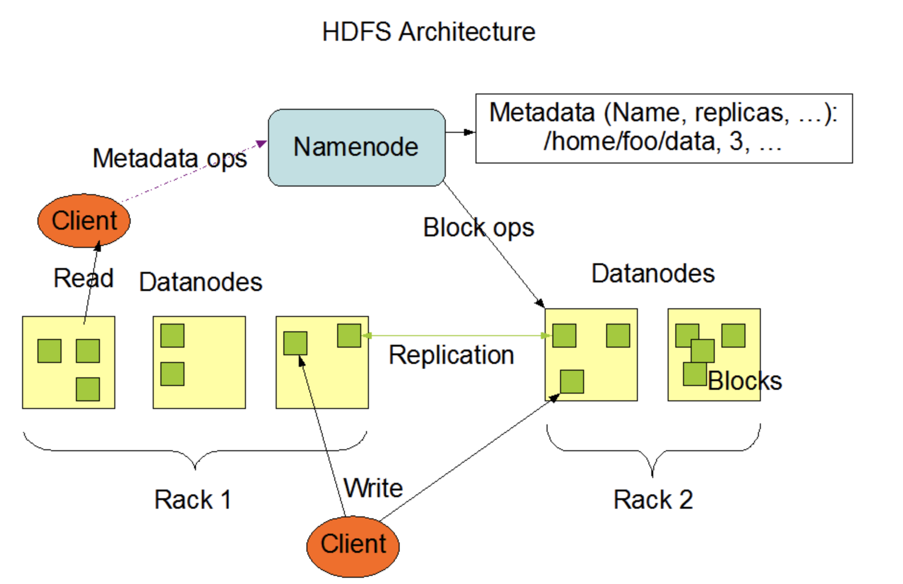
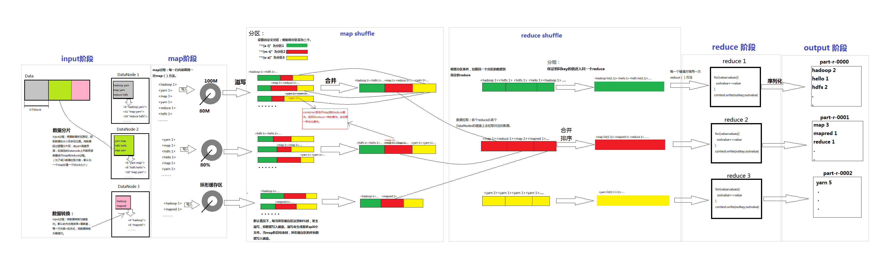
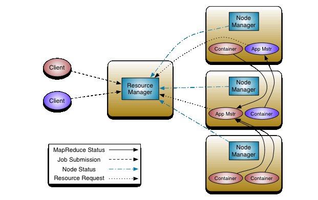

# hadoop


目录
=================
   * [hadoop]()
      * [大数据概述]()
         * [技术概念]()
      * [初识Hadoop]()
         * [Hadoop概述]()
            * [官方介绍]()
            * [模块]()
         * [Hadoop部署]()
            * [前置条件]()
            * [单节点Hadoop集群]()
               * [安装Hadoop]()
               * [配置文件]()
               * [启动HDFS]()
         * [Hadoop Distributeed File System]()
            * [官方介绍]()
            * [HDFS的架构]()
               * [NameNode]()
               * [DataNode]()
            * [<a href="http://hadoop.apache.org/docs/stable/hadoop-project-dist/hadoop-common/FileSystemShell.html" rel="nofollow">Hadoop命令行操作</a>](http://hadoop.apache.org/docs/stable/hadoop-project-dist/hadoop-common/FileSystemShell.html)
         * [MapReduce]()
            * [官网介绍]()
            * [MapReduce执行流程图]()
            * [核心概念]()
               * [Split]()
               * [InputFormat]()
               * [OutputFormat]()
               * [Mapper]()
               * [Reducer]()
               * [Combiner]()
               * [Partitioner]()
               * [Counters]()
         * [Yarn]()
            * [官网介绍]()
            * [Yarn架构图]()
            * [核心概念]()
               * [ResourceManager and the NodeManager]()
               * [ApplicationMaster]()
      * [<a href="https://github.com/kangapp/hadoop/tree/master/HDFSApp">项目实战</a>]()


## 大数据概述

### 技术概念
- 数据采集 （Flume，Sqoop）
- 数据存储（Hadoop）
- 数据处理、分析、挖掘（Hadoop，Spark，Flink）
- 可视化

## 初识Hadoop

### Hadoop概述
**Hadoop官网地址：http://hadoop.apache.org/**  

#### 官方介绍  

>The Apache™ Hadoop® project develops open-source software for reliable, scalable,distributed computing.
>
>The Apache Hadoop software library is a framework that allows for the distributed processing of large data sets across clusters of computers using simple programming models. It is designed to scale up from single servers to thousands of machines, each offering local computation and storage. Rather than rely on hardware to deliver high-availability, the library itself is designed to detect and handle failures at the application layer, so delivering a highly-available service on top of a cluster of computers, each of which may be prone to failures. 

#### 模块

- Hadoop Common  
支持其他模块的公共工具
- HDFS  
提供对应用数据高吞吐量访问的分布式文件系统  
- Hadoop YARN
作业调度和集群资源管理框架  
- Hadoop Mapreduce  
基于YARN，用于并行处理大数据集的系统
- Others

### Hadoop部署

#### 前置条件
- java
- ssh

#### 单节点Hadoop集群

##### 安装Hadoop
```
CDH版本下载：http://archive.cloudera.com/cdh5/cdh/5/   hadoop-2.6.0-cdh5.7.0.tar.gz  
```

##### 配置文件
- hadoop-env.sh
> export JAVA_HOME=${JAVA_HOME}

- core-site.xml  

| name      | value     | 	description             |
| --------- | --------- | --------------- |
| fs.defaultFS | hdfs://localhost:9000 | 文件系统主机和端口 |
| hadoop.tmp.dir | /tmp/hadoop-${user.name} | 数据存储临时文件夹 |

- hdfs-site.xml  

| name      | value     | 	description             |
| --------- | --------- | --------------- |
| dfs.replication | 1 | 缺省的block副本系数 |

##### 启动HDFS

> 第一次启动需格式化文件系统： $ bin/hdfs namenode -format  
启动NameNode和DataNode：  $ sbin/start-dfs.sh  
停止NameNode和DataNode：  $ sbin/stop-dfs.sh  
jps查看启动进程

### Hadoop Distributeed File System  

Hadoop官网介绍：http://hadoop.apache.org/docs/stable/hadoop-project-dist/hadoop-hdfs/HdfsDesign.html  

#### 官方介绍
*`distributed file system`* *`fault-tolerant`* *`commodity hardware`* *`high throughput`* *`large data sets`*  
>The Hadoop Distributed File System (HDFS) is a distributed file system designed to run on commodity hardware. It has many similarities with existing distributed file systems. However, the differences from other distributed file systems are significant. HDFS is highly fault-tolerant and is designed to be deployed on low-cost hardware. HDFS provides high throughput access to application data and is suitable for applications that have large data sets. HDFS relaxes a few POSIX requirements to enable streaming access to file system data. HDFS was originally built as infrastructure for the Apache Nutch web search engine project. HDFS is part of the Apache Hadoop Core project. The project URL is http://hadoop.apache.org/.  

#### HDFS的架构
  

*`master/slave`* *`NameNode/DataNodes`*
>HDFS has a master/slave architecture. An HDFS cluster consists of a single NameNode, a master server that manages the file system namespace and regulates access to files by clients. In addition, there are a number of DataNodes, usually one per node in the cluster, which manage storage attached to the nodes that they run on. HDFS exposes a file system namespace and allows user data to be stored in files. Internally, a file is split into one or more blocks and these blocks are stored in a set of DataNodes. The NameNode executes file system namespace operations like opening, closing, and renaming files and directories. It also determines the mapping of blocks to DataNodes. The DataNodes are responsible for serving read and write requests from the file system’s clients. The DataNodes also perform block creation, deletion, and replication upon instruction from the NameNode.

##### NameNode
- 负责客户端请求的响应（对文件系统命名空间进行操作，打开、关闭、重命名文件和目录）
- 负责元数据（文件的名字、副本系数、Block和DataNodes的映射关系）的管理

##### DataNode
- 存储用户的文件对应的数据块（Block）
- 定期向NameNode发送心跳信息，汇报本身及其所有的Block信息、健康状况
- 根据NameNode的指令执行Block的创建、删除和复制

#### [Hadoop命令行操作](http://hadoop.apache.org/docs/stable/hadoop-project-dist/hadoop-common/FileSystemShell.html)

### MapReduce

Hadoop官网介绍：http://hadoop.apache.org/docs/stable/hadoop-mapreduce-client/hadoop-mapreduce-client-core/MapReduceTutorial.html

#### 官网介绍

*`in-parallerl`* 
> Hadoop MapReduce is a software framework for easily writing applications which process vast amounts of data (multi-terabyte data-sets) in-parallel on large clusters (thousands of nodes) of commodity hardware in a reliable, fault-tolerant manner.

#### MapReduce执行流程图

  

#### 核心概念

##### Split
> MapReduce作业处理的数据块，是MapReduce中最小的计算单元。和HDFS中的block默认是一一对应的。

##### InputFormat
> 将输入数据进行分片(split)

##### OutputFormat
> 将job的内容输出到文件系统

##### Mapper
> 三个主要的方法，处理作业输入数据
```java
//任务开始之前执行一次
protected void setup(Context context) throws IOException, InterruptedException {
    // NOTHING
}

//输入块中的每个键值对都会执行一次
protected void map(KEYIN key, VALUEIN value, Context context) throws IOException,InterruptedException {
    context.write((KEYOUT) key, (VALUEOUT) value);
}

//任务结束时执行一次
protected void cleanup(Context context) throws IOException, InterruptedException {
    // NOTHING
}
```

##### Reducer
> 三个主要的方法，处理map的输出数据
```java
//任务开始之前执行一次
protected void setup(Context context) throws IOException, InterruptedException {
    // NOTHING
}

//map输出的每一个key都会执行一次
protected void reduce(KEYIN key, Iterable<VALUEIN> values, Context context) throws IOException,InterruptedException {
    for(VALUEIN value: values) {
      context.write((KEYOUT) key, (VALUEOUT) value);
    }
}
//任务结束时执行一次
protected void cleanup(Context context) throws IOException, InterruptedException {
    // NOTHING
}
```

##### Combiner
> 本质是Reducer，即在Map阶段执行Reducer方法，使用有限制条件(例如求平均值不适用)

##### Partitioner
> 接口，须实现分区规则，即key值和分区的映射关系

```java
//numPartitions为分区数量，即reduce的数量
//通过job.setNumReduceTasks(n)设置
public abstract int getPartition(KEY key, VALUE value, int numPartitions);
```

##### Counters
> 全局计数器，每个计数器可以是任何枚举类型，可以在map和reduce中使用
```java

//定义计数器
static enum CountersEnum {INPUT_WORDS}

// 获取指定计数器
Counter counter = context.getCounter(CountersEnum.class.getName(),CountersEnum.OUTPUT_WORDS.toString());

//执行计数功能
counter.increment(1);
```

### Yarn

Hadoop官网介绍：http://hadoop.apache.org/docs/stable/hadoop-yarn/hadoop-yarn-site/YARN.html

#### 官网介绍

*`resource management`*  *`job scheduling`* 
> The fundamental idea of YARN is to split up the functionalities of resource management and job scheduling/monitoring into separate daemons. The idea is to have a global ResourceManager (RM) and per-application ApplicationMaster (AM). An application is either a single job or a DAG of jobs.

#### Yarn架构图

 

#### 核心概念

##### ResourceManager and the NodeManager

>RM负责系统中所有应用资源的管理，NM是RM在每台机器上的代理，负责该机器容器（containers）的管理，监视并且向RM汇报容器资源（cpu、内存、磁盘、网络）使用情况。  

>RM主要由调度器（Scheduler）和应用管理器（ApplicationsManager）两部分组成  

- 调度器

>调度器负责给各种正在运行的和有相似的约束如容量、队列等的应用分配资源。调度器只是一个纯粹的调度器而不负责应用状态的监视和追踪。并且它也不负责重启由于程序故障和硬件故障导致失败的任务。调度器根据应用的资源需求来执行它的调度功能，主要是基于资源“container”的抽象概念，包含内存、cpu、硬盘和网络等元素。主要有两种类型：CapacityScheduler和FairScheduler.

- 应用管理器

>应用管理器负责接收作业的提交，选择第一个容器来运行AM并提供AM容器失败的重启服务。AM负责向调度器申请合适的资源容器，追踪和监视他们的状态

##### ApplicationMaster

>AM的任务是向RM申请资源、和NM协作执行和监视任务

## [项目实战](https://github.com/kangapp/hadoop/tree/master/HDFSApp)